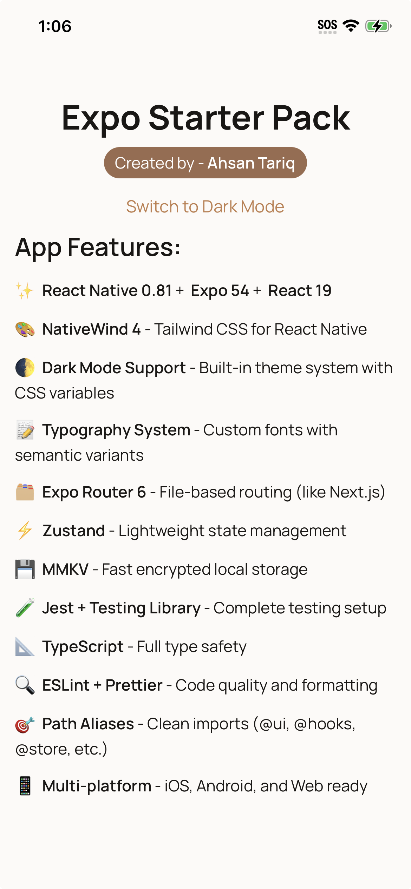

# Expo Starter Pack

A production-ready React Native Expo template for building modern cross-platform applications with TypeScript, NativeWind, dark mode support, and comprehensive tooling. Clone and customize to quickly spin up new Expo projects.

## Features

- ✨ **React Native 0.81** + Expo 54 + React 19
- 🎨 **NativeWind 4** - Tailwind CSS for React Native
- 🌓 **Dark Mode Support** - Built-in theme system with CSS variables
- 📝 **Typography System** - Custom fonts with semantic variants
- 🗂️ **Expo Router 6** - File-based routing (like Next.js)
- ⚡ **Zustand** - Lightweight state management
- 💾 **MMKV** - Fast encrypted local storage
- 🧪 **Jest + Testing Library** - Complete testing setup
- 📐 **TypeScript** - Full type safety
- 🔍 **ESLint + Prettier** - Code quality and formatting
- 🎯 **Path Aliases** - Clean imports (@ui, @hooks, @store, etc.)
- 📱 **Multi-platform** - iOS, Android, and Web ready

<p align="center">

</p>

## What's Included

This template comes with:

- Complete dark mode/light theme system with theme persistence
- Custom color palette (bronze/copper theme as example)
- Typography system with Manrope font
- Shared UI components and hooks
- Zustand store setup patterns
- Jest unit and integration test examples
- ESLint and Prettier configuration
- Expo Router file-based routing
- Feature-based folder structure

## Quick Start

### 1. Clone the Template

- Preferred: click **Use this template** on GitHub to create a new repository with this scaffold (no fork history).
- Alternative: clone directly

```bash
git clone <template-repo-url> my-app
cd my-app
```

### 2. Customize Colors and Typography

Update the color palette in `src/shared/constants/colors.ts` to match your brand.

Update typography in `src/shared/constants/typography.ts`.

### 3. Update App Icons

Replace the icons in `assets/images/`:

- `icon.png` - App icon
- `favicon.png` - Web favicon
- `splash-icon.png` - Splash screen
- `android-icon-*` - Android adaptive icons

### 4. Install Dependencies

```bash
bun install
```

If you skipped the setup script, install dependencies manually:

```bash
bun install
```

### 5. Start Development

```bash
bun start          # Start Expo dev server (interactive platform picker)
bun ios           # Run on iOS simulator
bun android       # Run on Android emulator
bun web           # Run on web
```

## Project Structure

```
expo-starter-pack/
├── app/                      # Expo Router screens (file-based routing)
├── src/
│   ├── features/             # Feature modules (one per feature)
│   └── shared/               # Shared across features
│       ├── ui/               # UI primitives (Button, Card, etc.)
│       ├── components/       # Composed components
│       ├── hooks/            # Custom React hooks
│       ├── store/            # Zustand stores
│       ├── providers/        # Context providers (Theme, etc.)
│       ├── constants/        # colors.ts, typography.ts
│       └── utils/            # Helper utilities
├── assets/                   # Images, fonts, icons
└── tailwind.config.js        # Tailwind configuration
```

## Development Commands

```bash
# Start development
bun start              # Interactive platform picker
bun ios               # Run on iOS
bun android           # Run on Android
bun web               # Run on web

# Code quality
bun run lint          # Check with ESLint
bun run lint:fix      # Fix linting issues
bun run format        # Format with Prettier
bun run format:check  # Check formatting

# Testing
bun test              # Run Jest tests
bun test --watch      # Watch mode

# Other
bun run reset-project # Clear caches and rebuild
```

## Tech Stack

| Tool             | Version | Purpose                  |
| ---------------- | ------- | ------------------------ |
| **Expo**         | 54      | Development platform     |
| **React Native** | 0.81    | Cross-platform framework |
| **React**        | 19      | UI library               |
| **Expo Router**  | 6       | File-based routing       |
| **TypeScript**   | 5.9     | Type safety              |
| **NativeWind**   | 4       | Tailwind CSS support     |
| **Tailwind CSS** | 3.4     | Utility-first CSS        |
| **Zustand**      | 5       | State management         |
| **MMKV**         | 4.1     | Fast local storage       |
| **Jest**         | 29      | Testing framework        |
| **ESLint**       | 9       | Code quality             |
| **Prettier**     | 3       | Code formatting          |

## Before You Commit

```bash
bun run format    # Format code with Prettier
bun run lint:fix  # Fix linting issues
bun test          # Run tests
bun run lint      # Verify no errors
```

## Building for Production

See [Expo Documentation](https://docs.expo.dev) for:

- Building for iOS (App Store)
- Building for Android (Google Play)
- Web deployment

## License

MIT - Feel free to use this template for any project.

## Support

For issues with:

- **Expo** → [Expo Docs](https://docs.expo.dev)
- **React Native** → [React Native Docs](https://reactnative.dev)
- **NativeWind** → [NativeWind Docs](https://www.nativewind.dev)
- **Tailwind** → [Tailwind Docs](https://tailwindcss.com)
- **TypeScript** → [TypeScript Docs](https://www.typescriptlang.org)

---

Happy coding! 🚀
